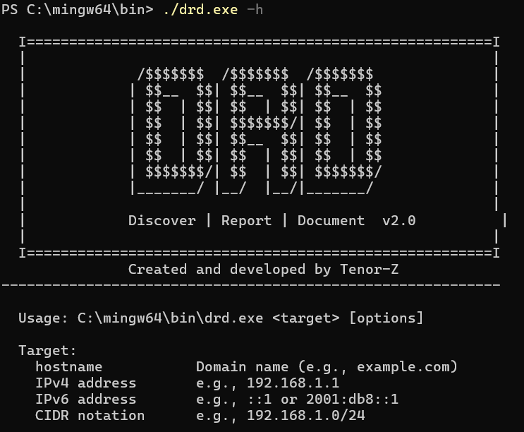

# DRD
### Discover | Report | Document


DRD is a lightweight network scanner written in C, focused on practical TCP/UDP port scanning, banner grabbing, and simple reporting.

It is being developed for low-level networking and cross-platform socket programming, with additional features being added over time.

<p align="center">

</p>

## Features

- TCP connect scanning
- Basic UDP probing (`open | filtered` detection)
- Banner grabbing for common services
- Simple banner-based version detection
- IPv4 support
- Limited IPv6 support
- CIDR range expansion (`192.168.1.0/24`)
- Top ports scanning (Top 20 / Top 100)
- HTML report generation
- Verbose output levels (`-v`, `-vv`, `-vvv`, `-q`)

---

## Planned / Experimental

- Improved IPv6 handling
- Rate limiting
- SOCKS5 proxy support
- SYN (stealth) scanning
- Stronger service/version detection
- Improved OS fingerprinting

---

## Installation

### Linux

```bash
gcc DRD_intel.c -o drd -pthread
